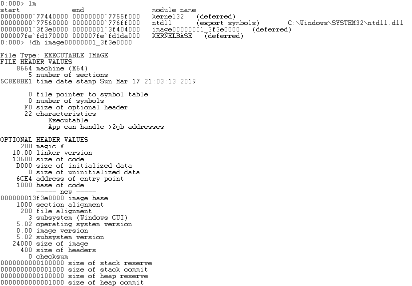

# Chapter 1: Win32 console application

A simple program which we will examine here is a "guess password" program. It should display a promtpt at console asking for a password, and then read a user's input. If password matches hardcoded value, then user is congratulated, otherwise password is asked again and again.
Our first task will be to make a working program, and then we will try different ways to alter the program so it allows any password

## Console password program
I strongly advice you not to use a program provided below, but to write such program yourself. You can use anything which is simple: C++ iostream operations, C file I/O functions (fputs, fgets), Win32API console read functions.

```
#include <iostream>

#define PWD_BUFF_SIZE 100

const char good_password[] = "iamrobot";

using namespace std;

int main(void) {
    char pwd_buffer[PWD_BUFF_SIZE];
    while (true) {
        cout << "Enter password:";
        cin >> pwd_buffer;
        if (!strcmp(pwd_buffer, good_password)) {
            cout << "Password is correct!\n";
            break;
        } else {
           cout << "Wrong password!\n";
        }
    }
}

```
You should be able to compile a program with following free tools available:
 * Microsoft Visual C++ compiler, which is available either as a part of Windows 7 SDK, or as a Community Edition of Microsoft Visual Studio. Program should be compiled simply by "cl <progname>", which will produce a binary executable statically linked with C and C++ runtime libraries
 * MinGW compiler, which is a version of GCC hosted by Windows and configured to produce Windows executables by default

Compile a program and check all use cases:
 * Program congratulates if you enter a correct password
 * Program complains if you enter wrong password, and asks to enter password again

 

## Defeating a program

Let's now imagine that you don't know the source code and don't know a correct password. Your task is to get past password protection. 

Well, since this program stores correct password in program's code in plain text, and such strings go in resulting executable binary file without any change, it should be possible to find a correct password just by looking into a binary file. For such a small program you can simplify your task even more by searching for a string which is printed by a program, like "Wrong password", because it's natural for a program to store all strings together

Most hex editors provide "search text" functionality. We will use HxD editor, but you can use any other.

Indeed, a password text is stored not far from "Wrong password" string.

 
 
However, the only thing we can do with such approach is to find a correct password. For more complex tasks, such as to alter a program so it can take any password as correct, we need tools.

## Using disassembler

Overall idea of using a disassmebler is following: we will disassemble program's code, and will try to find a code which prints "Wrong password" message. A code which checks a password should be somewhere near.

IDA is a great commercial disassembler, which has free versions available, and they will perfectly work for us. I'm using version 7.0
After starting IDA and opening a binary executable file we should search for "Wrong password" string.

 

Since our program is small, IDA will find this string quite quickly. A very useful feature of IDA is that it was able to find a place in code which reads a first address of our string. This place is shown as cross-reference (XREF), and we can quickly get there by double-clicking on it. 

 

OK, we can see that if we change instruction "test eax, eax" to "xor eax, eax" then program will always go to print "Password is correct" message. So now our task is to locate a machine code for this instruction in binary file and change it.
IDA provides a full hexadecimal virtual address of an instruction to be changed: "0000000140001055", and it also provides a section in binary executable where this instruction is stored: ".text".  

Now we should learn important information on how Windows loader maps content of binary executable file into virtual memory space of a process. A binary executable file consists of several "sections", and each section is mapped to virtual memory area starting with specified virtual address. However, these adresses are not specified exactly. Instead, they are represented as offsets from common virtual address called  "Image base".  So, to get virtual address of a section we need to add section's offset to image base. Fortunatelly, these numbers are provided by IDA at the beginning of disassembly

 

So, hexadecimal virtual address of ".text" section is 140001000. We also know that hexadecimalvirtual address of a byte we want to change is 0000000140001055,  so offset of a byte from beginning of a ".text" section is 55. Also IDA gives us hexadecimal offset of ".text" section in binary executable file, which is 400. So, hexadecimal offset of a byte in executable file is 455. 

 

Let's change value "85" to "33". Now let's save a modified program and check if it works.

 

There is also another, simpler way to patch a program, by using hexadecimal editor of IDA, which has a convenience of showing virtual addresses, and which will automatically highlight bytes which correspond to instruction selected in disassembly view. You can edit hexadecimal value. However, free version of IDA will not allow you to produce a working executable from modified content.

 

 


## Using debugger

Debuggers are interactive tools which let you control execution of binary files, and provide detailed information about execution state.
While IDA has performed a static analysis of binary executable, which allowed us to follow cross-reference from "Wrong password" string to a code which printed it, debugger allows to place a breakpoint at the start of "Wrong password" string, which will stop program's execution when program will attempt to access the string. Then we will use step-by-step execution of a program to get to the point where password is analyzed. 
We are goiing to use an approach quite similar to previous one: try to find "Wrong password" string in a memory of a process, then place a breakpoint at that location.
 
We will use WinDbg debugger which is a part of Windows debugging tools package.

 

Start the debugger, and use "open executable" command to start a new process. Debugger will stop at some place inside Windows system libraries, before execution of our binary file has started. This moment is a right time to place a breakpoint. To do that, however, we need to calculate an address of memory location where we want to place a breakpoint.
First, use "lm" command to list modules of a process which we are debugging. Among names of system dlls we will see a specific name corresponding to our binary executable file. We should also read starting virtual address of a module. Now we can use command "!dh <modulename>" to display a header of binary executable file. A header contains an offset of entry point of our program. To calculate full virtual address of an entry point we need to add start address of a module to offset of an entry point.  Please note that start address of a module equals to value of "Image base" field of a header, but this value is not the same as in binary executable file, it was updated by Windows loader.
Since we have calculated full virtual address of program's entry point, let's place a code execution breakpoint using command "bp <addr>", and then ask debugger to run a program with "g" command, until breakpoint will be triggerred.

 

When breakpoint will be hit, we know that our program is ready to be started. 

Now we should search memory for string "Wrong password". Command "s -a <start> l<length> <string>" will search ASCII string in memory starting from <start> address. We will supply image base address as start address, and length to be 100000 bytes. As soon as our search will be succesfull, we will use "db <start> l<length> command to display memory content around found string.

 

Excellent, we can even see correct password! But our aim here is to track the code which accesses string "Wrong password". We can achieve that by using memory read breakpoint placed with command "ba r <length> <addr>". After placing a breakpoint we need to resume program execution with "g" command.

 

When breakpoint will be triggered, it is a good idea to check call stack and see which function was reading the memory. Call stack is displayed by "k" command. Since call stack is deep, we can assume that we are inside some system function which prints a string to console. To check this, we can use "u" command to display disassembly
Main difference between usage of disassembler and debugger is that in debugger we have found a string and then IDA was looking for usages of address of that string. However, in debugger we have breakpoint on memory access, and the address of string came some long way before memory was accessed.
To run program till the end of current function we should use "gu" command. Next function returns immediatelly after we returned to it

 

By using paper and pencil to track currently executing function, we will see that breakpoint will be hit a second time if we use "gu" command. But finally we will get to top level loop:

 

This gives us a virtual address of instruction "test ax, ax". By substracting image base address and section offset, we can calculate byte offset from beginning of a section. Based on that number, we can calculate byte offset in file.