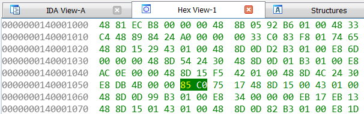

# Chapter 1: console Win32 app

A simple program which we will examine here is a "guess password" program. It should display a promtpt at console asking for a password, and then read a user's input. If password matches hardcoded value, then user is congratulated, otherwise password is asked again and again.
Our first task will be to make a working program, and then we will try different ways to alter the program so it allows any password

## Console password program
I strongly advice you not to use a program provided below, but to write such program yourself. You can use anything which is simple: C++ iostream operations, C file I/O functions (fputs, fgets), Win32API console read functions.

```
#include <iostream>

#define PWD_BUFF_SIZE 100

const char good_password[] = "iamrobot";

using namespace std;

int main(void) {
    char pwd_buffer[PWD_BUFF_SIZE];
    while (true) {
        cout << "Enter password:";
        cin >> pwd_buffer;
        if (!strcmp(pwd_buffer, good_password)) {
            cout << "Password is correct!\n";
            break;
        } else {
           cout << "Wrong password!\n";
        }
    }
}

```
You should be able to compile a program with following free tools available:
 * Microsoft Visual C++ compiler, which is available either as a part of Windows 7 SDK, or as a Community Edition of Microsoft Visual Studio. Program should be compiled simply by "cl <progname>", which will produce a binary executable statically linked with C and C++ runtime libraries
 * MinGW compiler, which is a version of GCC hosted by Windows and configured to produce Windows executables by default

Compile a program and check all use cases:
 * Program congratulates if you enter a correct password
 * Program complains if you enter wrong password, and asks to enter password again

 

## Defeating a program

Let's now imagine that you don't know the source code and don't know a correct password. Your task is to get past password protection. 

Well, since this program stores correct password in program's code in plain text, and such strings go in resulting executable binary file without any change, it should be possible to find a correct password just by looking into a binary file. For such a small program you can simplify your task even more by searching for a string which is printed by a program, like "Wrong password", because it's natural for a program to store all strings together
 
  
However, the only thing we can do with such approach is to find a correct password. For more complex tasks, such as to alter a program so it can take any password as correct, we need tools.

## Using disassembler

Overall idea of using a disassmebler is following: we will disassemble program's code, and will try to find a code which prints "Wrong password" message. A code which checks a password should be somewhere near.

IDA is a great commercial disassembler, which has free versions available, and they will perfectly work for us. I'm using version 7.0
After starting IDA and opening a binary executable file we should search for "Wrong password" string.
 
 
Since our program is small, IDA will find this string quite quickly. A very useful feature of IDA is that it was able to find a place in code which reads a first address of our string. This place is shown as cross-reference (XREF), and we can quickly get there by double-clicking on it. 
 
OK, we can see that if we change instruction "test eax, eax" to "xor eax, eax" then program will always go to print "Password is correct" message. So now our task is to locate a machine code for this instruction in binary file and change it.
IDA provides a full hexadecimal virtual address of an instruction to be changed: "0000000140001055", and it also provides a section in binary executable where this instruction is stored: ".text".  

Now we should learn important information on how Windows loader maps content of binary executable file into virtual memory space of a process. A binary executable file consists of several "sections", and each section is mapped to virtual memory area starting with specified virtual address. However, these adresses are not specified exactly. Instead, they are represented as offsets from common virtual address called  "Image base".  So, to get virtual address of a section we need to add section's offset to image base. Fortunatelly, these numbers are provided by IDA at the beginning of disassembly
 

So, hexadecimal virtual address of ".text" section is 140001000. We also know that hexadecimalvirtual address of a byte we want to change is 0000000140001055,  so offset of a byte from beginning of a ".text" section is 55. Also IDA gives us hexadecimal offset of ".text" section in binary executable file, which is 400. So, hexadecimal offset of a byte in executable file is 455. 
 
Let's change value "85" to "33". Now let's save a modified program and check if it works.
 
There is also another, simpler way to patch a program, by using hexadecimal editor of IDA, which has a convenience of showing virtual addresses, and which will automatically highlight bytes which correspond to instruction selected in disassembly view. You can edit hexadecimal value. However, free version of IDA will not allow you to produce a working executable from modified content.
 
 
